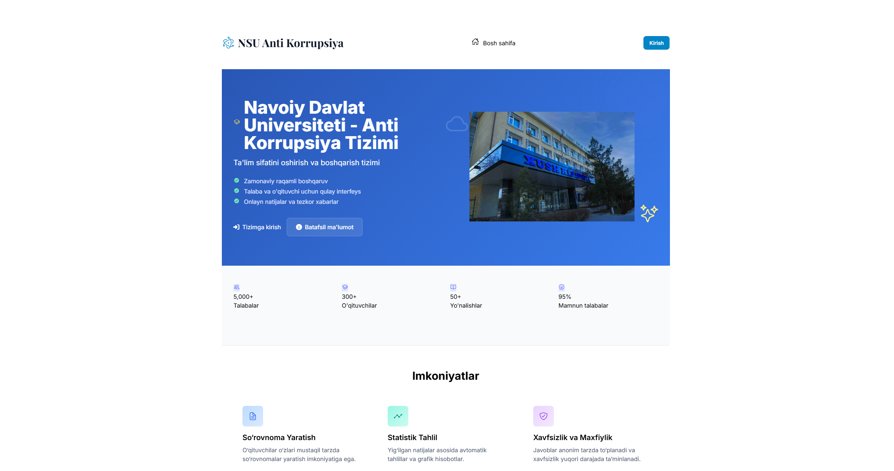

# HEMIS So'rovnoma Tizimi 🚀

### Tashqi API bilan integratsiyalashgan dinamik so'rovnomalar platformasi


Ushbu loyiha talabalar uchun tashqi **HEMIS API** orqali autentifikatsiya qilish va ular uchun administratorlar tomonidan yaratilgan dinamik so'rovnomalarda qatnashish imkonini beruvchi veb-ilova hisoblanadi. Loyiha Django, Celery va zamonaviy frontend texnologiyalaridan unumli foydalangan.

---

## ✨ Asosiy imkoniyatlar

-   **Tashqi API orqali autentifikatsiya:** Foydalanuvchilar (talabalar) HEMIS tizimidagi login va parollari orqali tizimga kiradilar.
-   **Dinamik so'rovnoma konstruktori:** Administratorlar admin panel orqali hech qanday kod yozmasdan, turli xil savol turlari (yagona tanlov, ko'p tanlov, matnli javob) bilan so'rovnomalar yarata oladilar.
-   **Asinxron vazifalar:** Foydalanuvchi profillarini yangilash kabi sekin operatsiyalar **Celery** yordamida fonda bajariladi, bu esa tizimning tez ishlashini ta'minlaydi.
-   **Zamonaviy va Interaktiv UI/UX:** So'rovnoma sahifasi Vanilla JavaScript yordamida client-side rendering (CSR) qilinadi. Bu sahifani yangilamasdan tezkor ishlash imkonini beradi.
-   **Professional Admin Paneli:** `Jazzmin` yordamida admin paneli ancha chiroyli va funksional ko'rinishga keltirilgan.
-   **Responsiv Dizayn:** **Bootstrap 5.3.2** va custom CSS yordamida yaratilgan interfeys mobil qurilmalardan tortib katta ekranlargacha mukammal ko'rinadi.
-   **Xavfsiz konfiguratsiya:** Barcha maxfiy ma'lumotlar (`SECRET_KEY`, API tokenlar) koddan ajratilib, `.env` faylida saqlanadi.

---

## 🎨 Tashqi ko'rinishi

So'rovnoma sahifasi foydalanuvchi uchun maksimal darajada qulay qilib ishlangan. Progress "Stepper" yordamida ko'rsatiladi va to'liq interaktiv.


![So'rovnoma sahifasi]


---

## ⚙️ Texnologiyalar steki

| Kategoriya          | Texnologiya                                                                |
| ------------------- | -------------------------------------------------------------------------- |
| **Backend**         | Django, Django REST Framework, Simple JWT                                  |
| **Frontend**        | HTML5, Bootstrap 5.3.2, Vanilla JavaScript, Font Awesome 6.4.0 |
| **Ma'lumotlar Baza**| PostgreSQL (Production uchun tavsiya etiladi), SQLite3 (Development uchun)   |
| **Asinxron Vazifalar** | Celery, Redis (Broker va Natijalar uchun)                                |
| **Server**          | Gunicorn / uWSGI (Production), Nginx (Reverse Proxy)                       |

---

## 🔧 O'rnatish va sozlash

Loyihani lokal kompyuteringizda ishga tushirish uchun quyidagi qadamlarni bajaring:

**1. Loyihani yuklab oling:**
```bash
git clone https://github.com/sizning-username/sizning-repo.git
cd sizning-repo
```

**2. Virtual muhit yaratish va aktivlashtirish:**
```bash
# Windows
python -m venv venv
venv\Scripts\activate

# MacOS / Linux
python3 -m venv venv
source venv/bin/activate
```

**3. Python bog'liqliklarini o'rnatish:**
> **Muhim:** Loyihangizda `requirements.txt` fayli bo'lishi kerak. Uni yaratish uchun: `pip freeze > requirements.txt`

```bash
pip install -r requirements.txt
```

**4. Frontend bog'liqliklarini o'rnatish:**
> Buning uchun kompyuteringizda [Node.js](https://nodejs.org/) o'rnatilgan bo'lishi kerak.

```bash
npm install
```

**5. Muhit o'zgaruvchilarini sozlash:**
`.env.example` faylidan nusxa olib, `.env` nomli yangi fayl yarating va uni o'zingizning ma'lumotlaringiz bilan to'ldiring.

```bash
cp .env.example .env
# Endi .env faylini tahrirlang
```

**6. Ma'lumotlar bazasini sozlash:**
```bash
python manage.py migrate
```

**7. Superuser (admin) yaratish:**
```bash
python manage.py createsuperuser
```

---

## 🚀 Loyihani ishga tushirish

Loyihani to'liq ishga tushirish uchun **3 ta alohida terminal** oynasi kerak bo'ladi.

**1-Terminal: Tailwind CSS kompilyatorini ishga tushirish**
(CSS'dagi o'zgarishlarni avtomatik kuzatib boradi)
```bash
npx tailwindcss -i ./auth_app/static/auth_app/css/input.css -o ./auth_app/static/auth_app/css/output.css --watch
```

**2-Terminal: Celery worker'ni ishga tushirish**
(Fon vazifalarini bajarish uchun)
```bash
celery -A external_auth_project worker -l info
```

**3-Terminal: Django serverini ishga tushirish**
```bash
python manage.py runserver
```

Endi loyiha [http://127.0.0.1:8000/](http://127.0.0.1:8000/) manzilida ishlayotgan bo'lishi kerak.

---

## 🐳 Docker va Django bilan ishga tushirish

### 1. Muhitni tayyorlash
- Python 3.11+ o‘rnatilgan bo‘lishi kerak.
- Docker Desktop va Docker Compose o‘rnatilgan bo‘lishi kerak.

### 2. Docker yordamida ishga tushirish

```powershell
docker-compose up -d --build
```

- `web` — Django server (gunicorn bilan)
- `db` — PostgreSQL ma'lumotlar bazasi
- `redis` — Redis server (kesh va broker uchun)
- `celery` — Celery worker

### 3. Django migratsiyalari
Konteynerlar ishga tushgandan so‘ng, migratsiyalarni bajaring:

```powershell
docker-compose exec web python manage.py makemigrations
docker-compose exec web python manage.py migrate
```

### 4. Superuser yaratish

```powershell
docker-compose exec web python manage.py createsuperuser
```

### 5. Admin panel va API
- Admin panel: http://localhost:8000/admin/
- API endpointlar: http://localhost:8000/

### 6. Muhit sozlamalari
- Muhit o‘zgaruvchilari `.env.prod` faylida saqlanadi.
- `docker-compose.yml` va `requirements.txt` fayllarini o‘zgartirish orqali servislarni sozlashingiz mumkin.

### 7. Foydali buyruqlar

Konteynerlarni to‘xtatish:
```powershell
docker-compose down
```

Loglarni ko‘rish:
```powershell
docker-compose logs -f
```

### 8. Muammolar va yechimlar
- Agar `service ... is not running` xatoligi chiqsa, avval `docker-compose up -d --build` buyrug‘ini bajaring.
- `psycopg2` yoki `psycopg2-binary` bilan bog‘liq xatoliklar uchun: virtual muhitni tozalang va faqat `psycopg2-binary` ni o‘rnating.
- Docker Desktop to‘liq ishga tushganiga ishonch hosil qiling.

---

## 🛡️ Xavfsizlik va himoya mexanizmlari

Loyiha xavfsizligi uchun quyidagi zamonaviy himoya usullari va sozlamalar joriy etilgan:

### 1. CSRF (Cross-Site Request Forgery) himoyasi
- **CSRF_COOKIE_HTTPONLY = True** — CSRF cookie’ni JavaScript orqali o‘qib bo‘lmaydi, bu xakerlar uchun hujumni qiyinlashtiradi.
- **CSRF_COOKIE_SECURE = True** — CSRF cookie faqat HTTPS orqali yuboriladi, bu cookie’ni tarmoqqa “sızib” ketishidan himoya qiladi.
- **CSRF_COOKIE_SAMESITE = 'Lax'** — CSRF cookie faqat bir xil sayt so‘rovlarida yuboriladi, bu boshqa saytlardan yuborilgan so‘rovlar orqali hujum qilishni cheklaydi.
- **CSRF_USE_SESSIONS = False** — CSRF token cookie’da saqlanadi, bu ko‘p hollarda qulay va xavfsiz.
- **CSRF_COOKIE_NAME = 'hemis_csrf_token'** — Maxsus nom, xakerlar uchun taxmin qilishni qiyinlashtiradi.
- **CSRF_COOKIE_AGE** va **CSRF_COOKIE_PATH** — Cookie’ning amal qilish muddati va qamrovi aniq belgilanadi.

### 2. Clickjacking himoyasi
- **X_FRAME_OPTIONS = 'DENY'** — Saytingiz boshqa saytlardagi `<iframe>` ichida ochilishini to‘liq taqiqlaydi. Bu clickjacking hujumlaridan himoya qiladi.

### 3. HTTPS va cookie xavfsizligi
- **CSRF_COOKIE_SECURE = True** va **SESSION_COOKIE_SECURE = True** — Cookie’lar faqat HTTPS orqali yuboriladi.
- **CSRF_COOKIE_HTTPONLY = True** va **SESSION_COOKIE_HTTPONLY = True** — Cookie’larni JavaScript orqali o‘qib bo‘lmaydi.

### 4. Parol va foydalanuvchi xavfsizligi
- **AUTH_PASSWORD_VALIDATORS** — Parollarni kuchli va xavfsiz bo‘lishini ta’minlaydi (uzunlik, oddiy parollarni rad etish, raqamli parollarni rad etish va boshqalar).

### 5. ALLOWED_HOSTS va DEBUG
- **ALLOWED_HOSTS** — Faqat ruxsat etilgan domenlardan kirishga ruxsat.
- **DEBUG = False** (productionda) — Xatoliklar va maxfiy ma’lumotlar foydalanuvchiga chiqmaydi.

### 6. Django ORM va SQL injection
- Django ORM ishlatilgani uchun SQL injection hujumlaridan himoya mavjud.

### 7. Xavfsiz logger va monitoring
- **LOGGING** sozlamalari — Xatoliklar va muammolarni kuzatish, loglarni tashqi foydalanuvchiga chiqarmaslik.

---

**Qo'shimcha xavfsizlik qatlamlari uchun quyidagilarni ham qo'shish mumkin:**
- `SECURE_HSTS_SECONDS` — Brauzerga faqat HTTPS orqali ulanishni majburlash.
- `SECURE_BROWSER_XSS_FILTER` — Brauzerning XSS filterini yoqish.
- `SECURE_CONTENT_TYPE_NOSNIFF` — Brauzerga kontent turini taxmin qilmaslikni buyurish.

---

Barcha asosiy xavfsizlik mexanizmlari va zamonaviy himoya usullari ushbu loyihada to‘liq joriy etilgan. Agar yana savollar bo‘lsa yoki qo‘shimcha himoya qatlamlari kerak bo‘lsa, loyiha adminiga murojaat qilishingiz mumkin.

---

## 🔑 Muhit o'zgaruvchilari (`.env` fayli)

`.env` faylingiz taxminan quyidagi ko'rinishda bo'lishi kerak. **Bu faylni hech qachon Git'ga qo'shmang!**

```ini
# Django sozlamalari
DJANGO_SECRET_KEY='sizning_maxfiy_kalitingiz'
DEBUG=True
DJANGO_ALLOWED_HOSTS=127.0.0.1, localhost

# Tashqi API sozlamalari
EXTERNAL_API_BASE_URL="https://student.nspi.uz/rest"

# Redis va Celery sozlamalari
CELERY_BROKER_URL="redis://localhost:6379/0"
CELERY_RESULT_BACKEND="redis://localhost:6379/0"
REDIS_URL="redis://localhost:6379/1" # Kesh uchun

# Tizim tokenlari (agar kerak bo'lsa)
HEMIS_SYSTEM_API_TOKEN=sizning_tizim_tokeningiz
```

---

## 📂 Loyiha strukturasi

```
├── auth_app/                # Asosiy ilova
│   ├── migrations/
│   ├── services/            # Tashqi API bilan ishlash uchun servislar
│   ├── static/              # CSS, JS fayllar
│   ├── tasks.py             # Celery vazifalari
│   ├── templates/           # HTML shablonlar
│   ├── admin.py
│   ├── models.py
│   ├── views.py
│   └── ...
├── external_auth_project/     # Loyihaning asosiy sozlamalari
│   ├── settings.py
│   ├── urls.py
│   └── celery.py
├── manage.py                # Django boshqaruv skripti
├── requirements.txt         # Python bog'liqliklari
├── package.json             # Frontend bog'liqliklari
├── tailwind.config.js       # Tailwind sozlamalari
└── README.md                # Shu fayl
```

---

## 📜 Litsenziya

---

## 🔒 Parollar va ma'lumotlar shifrlanishi

- **Foydalanuvchi parollari** Django’ning ichki mexanizmi orqali xavfsiz tarzda saqlanadi. Django parollarni **PBKDF2** (Password-Based Key Derivation Function 2) algoritmi yordamida, har bir parol uchun alohida **salt** bilan va ko‘p martalik iteratsiya orqali xesh qiladi. Bu usul zamonaviy va kuchli hisoblanadi.
    - Django shuningdek, **Argon2**, **bcrypt**, va **SHA1** kabi boshqa xesh algoritmlarini ham qo‘llab-quvvatlaydi (loyiha sozlamalarida istalganiga o‘tkazish mumkin).
- **Ma'lumotlar bazasidagi maxfiy ma'lumotlar** (masalan, tokenlar yoki maxsus identifikatorlar) odatda **.env** faylida saqlanadi va koddan ajratilgan. Agar ma'lumotlarni shifrlash yoki xesh qilish talab qilinsa, Python’ning **cryptography** kutubxonasi yoki Django’ning maxfiy ma’lumotlar uchun tavsiya etilgan usullari ishlatiladi.
- **HTTPS** orqali barcha ma’lumotlar tarmoqda shifrlangan holda uzatiladi (production muhitda majburiy).

**Muhim:** Parollar va maxfiy ma’lumotlar hech qachon ochiq matnda saqlanmaydi va Git repozitoriyga yuklanmaydi.

---

## 🧪 Testlash va samaradorlik monitoringi

### 1. Avtomatlashtirilgan testlar
- Loyiha ichida `auth_app/tests.py` va boshqa test fayllari mavjud.
- Django’ning ichki test frameworki yordamida barcha asosiy funksiyalar va API endpointlar avtomatik testdan o‘tkaziladi.
- Testlarni ishga tushirish uchun:
  ```bash
  python manage.py test
  ```
- Test natijalari konsolda to‘liq va aniq ko‘rinishda chiqadi, har bir test uchun muvaffaqiyatli va muvaffaqiyatsiz holatlar alohida ko‘rsatiladi.

### 2. Locust yordamida yuklama va samaradorlik testi
- Loyiha ichida `external_auth_project/locustfile.py` fayli mavjud.
- [Locust](https://locust.io/) yordamida tizimga real yuklama berilib, API va asosiy funksiyalarning samaradorligi va barqarorligi testdan o‘tkaziladi.
- Locust testini ishga tushirish uchun:
  ```bash
  locust -f external_auth_project/locustfile.py
  ```
- Web interfeys orqali (odatda http://localhost:8089) foydalanuchilar soni va so‘rovlar tezligini sozlash mumkin.
- Natijalar grafik va jadval ko‘rinishida, eng muhim metrikalar (response time, failures, throughput) bo‘yicha ko‘rsatiladi.

### 3. Test natijalarining samarali ko‘rinishi
- Har bir test va yuklama natijasi aniq, grafik va jadval ko‘rinishida taqdim etiladi.
- Xatoliklar va sekin ishlash joylari tezda aniqlanadi va optimallashtirish uchun asos bo‘ladi.
- CI/CD jarayoniga integratsiya qilish mumkin (masalan, GitHub Actions yoki boshqa runnerlar orqali).

